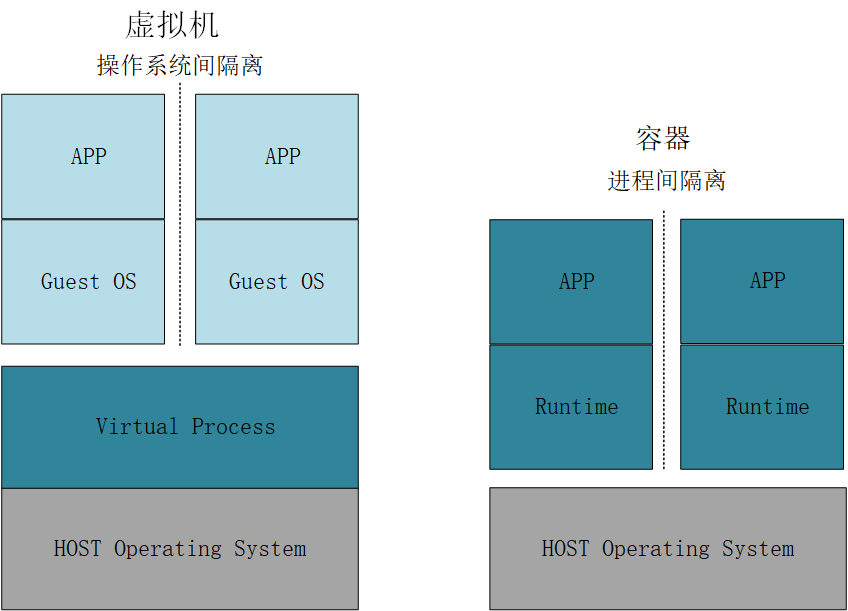
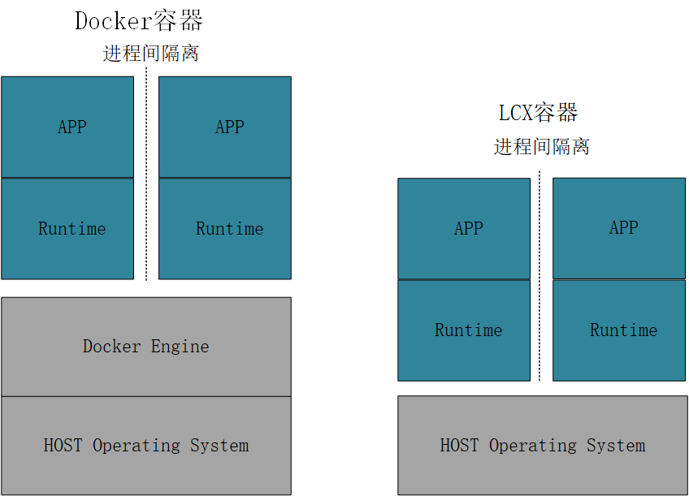

# 虚拟机、容器、云原生-2

## 容器

### 容器是什么？

容器就是一种进程，与操作系统上 ，其他进程隔离开的一系列进程；

* 一系列与系统其它进程隔离的进程；
  * 隔离性
  * 轻量级部署
* 镜像提供，进程运行的内容；
  * 可移植性
  * 一致性
* 镜像由**应用和运行时环境**打包组成；

### 为什么使用容器？

容器的特点：隔离性、可移植性、一致性、轻量级部署；所以，

* 通过把应用及所有依赖项打包，使应用不受环境影响；
* 可在不同环境下，快速、可靠地迁移、运行应用；
* 从而，加速开发并满足新出现的业务需求；

### 容器与虚拟化的区别

主要在扩展性和可移植性；

* 容器，基于操作系统，完成进程间的隔离；
  * 进程内封装应用及其所依赖的环境；
  * 兆字节大小；
* 虚拟化，基于操作系统或硬件，完成系统间的隔离；
  * 包含整个操作系统；
  * 千兆字节大小；

### 容器的实现技术

#### LXC

LXC，一种Linux 内核容器虚拟化的技术；（Linux Container）

* 通过Cgroups 资源管理机制、Linux Namespace 视图隔离方案，进行进程的资源隔离和视图隔离；
  * 控制组（cgroups）是一项内核功能，能够控制和限制一个进程或多组进程的资源使用。
  * systemd 初始化系统可设置用户空间，并且管理它们的进程（同个Namespace下父子进程的继承关系）。
* 从而实现资源的隔离和控制，让应用运行在独立的环境；

#### Docker

* docker技术
  * 容器化技术，用于支持创建和使用 [Linux® 容器](https://www.redhat.com/zh/topics/containers)。
* docker社区
  * [开源 Docker 社区](https://forums.docker.com/)致力于改进这类技术，并免费提供给所有用户，使之获益。
* docker公司及支持的技术栈
  * [Docker Inc.](https://www.docker.com/) 公司凭借 Docker 社区产品起家，它主要负责提升社区版本的安全性，并将技术进步与广大技术社区分享。

## Docker技术

### Docker与LCX的关系：

* Docker 技术早期使用LXC（使用内核的 Cgroup 和 Namespace 特性）；
* 后来自己封装了 libcontainer （golang 的库）实现 Cgroup 和 Namespace 控制，从而消除了对 lxc 的依赖。
* 所以，lxc 是早期版本 docker 的一个基础组件。

### Docker带来的新技术（与传统Linux容器的区别）：

* 分层镜像
* 服务器守护进程
* 含有预构建容器镜像的库
* 注册表服务器
  * 自行构建的镜像，需推送至云技术提供商的注册表服务器，才能提供出可共享的镜像；

Docker新技术带来的影响：

* 提出的应用打包规范，使应用与运行环境解耦；
  * 3 个主要标准，来确保各种容器技术间的互操作性；
  * OCI 镜像、分发和运行时规范；
    * OCI（开放容器镜像）
* 通过分层的容器镜像，用户可快速构建容器并分享；

### Docker的优点：

#### 模块化

* Docker 容器化方法非常注重在不停止整个应用的情况下，单独截取部分应用进行更新或修复的能力。
* 基于SOA的两种方法，共享进程；
  * 中心化方式：ESB（服务总线、服务提供者、业务流程重构、服务寻址、分布式事务模式）
  * 微服务：服务的提供、注册和调用

#### 层和镜像版本控制

* 每个 Docker 镜像文件都包含多个层。这些层组合在一起，构成单个镜像。每当镜像发生改变时，就会创建一个新的镜像层。用户每次发出命令（例如 _run_ 或 _copy_）时，都会创建一个新的镜像层。
* Docker 重复使用这些层来构建新容器，借此帮助加快流程构建。镜像之间会共享中间变化，从而进一步提升速度、[规模](http://developers.redhat.com/blog/2016/03/09/more-about-docker-images-size/)以及效率。
* 版本控制是镜像层本身自带的能力。每次发生新的更改时，可以获得一个内置的更改日志，实现对容器镜像的全盘管控。

#### 回滚

* 每个镜像都拥有多个层，如果需要取消迭代后的镜像版本，可以通过回滚，返回之前的版本。
* 该功能还支持敏捷开发方法，帮助[持续实施集成和部署（CI/CD）](https://www.redhat.com/zh/topics/devops/what-is-ci-cd)，通过工具层面调用。

#### 快速部署

* 启动和运行新硬件、实施部署并投入使用，基于 Docker 的容器可将部署时间缩短到几秒。（过去一般需要数天时间，且投入大量人力成本）
* 通过为每个进程构建容器，可以快速发布新的应用。
* 而且由于无需启动操作系统即可添加或移动容器，因此部署时间

  大幅缩短。

* 除此之外，因为部署速度的提升，可以高效地创建和销毁容器创建的数据。

因此，Docker 技术是一种更加精细、可控、**基于微服务**的技术，可为企业提供更高的效率价值。

### Docker的缺点

#### 容器的管理和编排--k8s

* 管理和编排变得非常困难。需要使用工具，对容器实施分组，以便跨所有容器提供网络、安全、遥测等服务。Kubernetes 正是这样的工具；

#### Docker守护进程

* [Docker 守护进程](https://docs.docker.com/engine/reference/commandline/dockerd/)可能存在安全隐患。
* Docker 守护进程，为容器提供持续运行时环境，需要根权限。所以需要特别留意谁可以访问该进程，以及进程驻留在哪个位置。例如，相比公共区域所用的守护进程（例如 Web 服务器），本地守护进程的受攻击面要小得多

## 容器和虚拟机

### 容器与虚拟机的区别

* 虚拟机（虚拟化技术）
  * 资源池化
  * 环境隔离
    * 虚拟机间的隔离
    * 底层硬件隔离
* 容器
  * 应用+运行时环境；
    * 方便打包、隔离、迁移、部署；
  * 进程隔离；根据镜像构建进程内容；
    * 可移植性、一致性；

> 容器必须与底层操作系统兼容。（ARM Linux 系统运行 ARM Linux 容器，x86 Linux 系统运行 x86 Linux 容器，x86 Windows 系统运行 x86 Windows 容器）；
>
> 虚拟机则是为了解决底层硬件的隔离问题；
>
> Docker 是比虚拟机的虚拟化程度更弱、效率更高的线程级别的隔离；

### 各自的适用场景

容器适合用于：

* 构建**云原生应用**
* **封装微服务**
* 拓展 **DevOps 或 CI/CD** 实践
* 在共享同一操作系统的多样化 IT 环境中移动可扩展的 IT 项目（**环境多样化**，**系统可扩展**）

虚拟机适合用于：

* 存放传统的**单体式**工作负载
* 隔离存在风险的开发周期（**隔离存在风险的环境**）
* 置备[**基础架构**](https://www.redhat.com/zh/topics/cloud-computing/what-is-it-infrastructure)**资源**（如网络、服务器和[数据](https://www.redhat.com/zh/topics/big-data)）
* 在一个操作系统内**运行不同的操作系统**（例如在 [Linux](https://www.redhat.com/zh/topics/linux) 上运行 Unix）

### 与IaaS、PaaS的关系

IaaS：基础设施 作为服务； PaaS：平台 作为服务；

* 虚拟机，基于操作系统，甚至硬件，模拟出一套隔离的操作系统；
  * 所以创建，使用虚拟机，必定是基于IaaS服务的；
* 容器，基于操作系统，根据镜像模拟出一系列隔离的进程；
  * 用户可能会基于物理机、虚拟机中的操作系统，使用容器技术和容器编排技术，基于IaaS；
  * 但是，用户也可能基于部署好的容器管理平台（k8s），直接使用和管理容器，则基于Paas服务；

#### 容器的安全

什么是容器安全？

[https://www.redhat.com/zh/topics/security/container-security](https://www.redhat.com/zh/topics/security/container-security)

后续补充

#### 容器的生命周期

后续补充

> 参考资料：
>
> [https://creaink.github.io/post/Computer/Linux/Linux-namespace.html](https://creaink.github.io/post/Computer/Linux/Linux-namespace.html)
>
> [容器与虚拟机](https://www.redhat.com/zh/topics/containers/containers-vs-vms)
>
> [了解 Linux 容器](https://www.redhat.com/zh/topics/containers)
>
> [什么是Docker？原理，作用，限制和优势简介](https://www.redhat.com/zh/topics/containers/what-is-docker)

