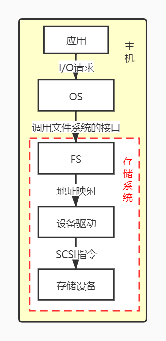
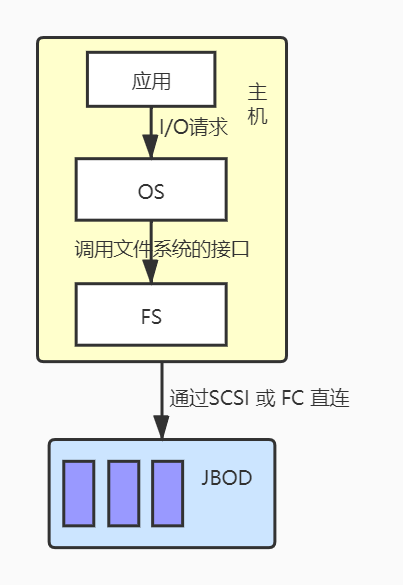
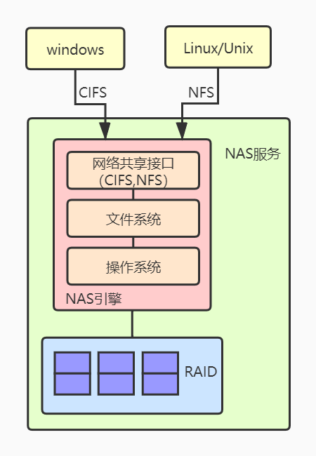
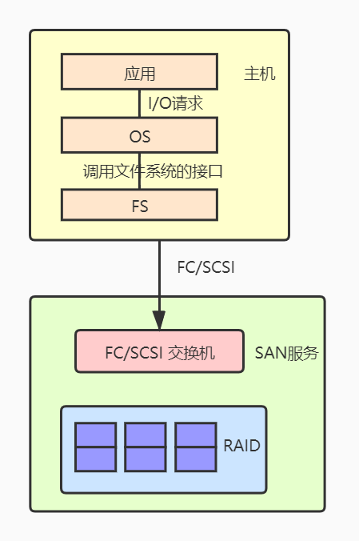

# 云原生-存储类型

根据服务器类型和连接方式分类

* 封闭系统的存储（大型机，AS400等服务器）
* 开放系统的存储（Windows、UNIX、Linux等操作系统的服务器）
  * 内置存储
  * 外挂存储
    * DAS（直连式存储，Direct Attached Storage）
    * FAS（网式存储，Fabric Attached Storage）
      * NAS（网络接入存储，Network Attached Storage）
      * SAN（存储区域网络，Storage Area Network）

## 内置存储

早期存储类型，又称本地存储；

本地存储的问题：

* 有限的硬盘槽；垂直扩展成为瓶颈；
* 数据存放单硬盘；数据安全问题；
* 存储设备只由当前主机使用；不可共享，利用率低；
* 扩容时需停机，且是垂直扩容；可扩展性差；

## 外挂存储

### DAS

* 主机通过SCSI 或 FC 直连存储设施（JBOD或RAID）

主要问题：

* 服务器扩容，存储阵列扩容，都会造成停机；
* 主机建立的SCSI通道连接有限，SCSI通道将会成为IO瓶颈；

### NAS

* 主机通过网络交换机（以太网 Switches），连接由NAS引擎、存储设备组成的专用于数据存储的服务；

特点：

* 用户通过TCP/IP协议访问数据，采用业界标准文件共享协议如：NFS、HTTP、CIFS实现共享。
  * 满足协议标准即可，无兼容性要求；
  * Windows常用CIFS；Unix/Linux常用NFS；
* 主机通过网络文件系统协议，访问外部的文件系统（NAS）；
  * 主机资源占用小，对网络带宽要求高；

### SAN

* 主机通过光纤通道交换机（FC Switches）和FC、IP网络连接磁盘阵列，磁盘阵列网络化，建立用于存储的网络。
  * 磁盘阵列可同时被多个主机访问；

特点：

* 通过专用光纤通道交换机访问数据，采用SCSI、FC-AL接口；
  * 主机和光纤交换技术有兼容性问题；
* 每个主机需安装FS（文件管理系统）；
  * 对主机的FS来说，SAN是一个硬盘；

