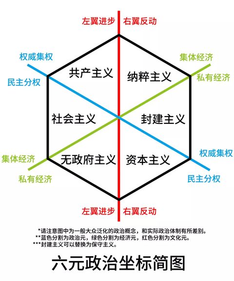

# 读《如果变成修正主义，你们怎么办？》有感

判断左派、右派、极左、极右的标准，只有一个，即其主张是激进还是保守。

主张，是指目的，是根本，而手段不是。（因此很好地解释了，极左极右都可能存在对社会极大的危害和暴力）

左派：激进

源自法国大革命时期，在制宪会议中第三等级的代表坐在左侧，支持共和制、大众政治运动和世俗化。

右派：保守

极左：极端激进

极右：极端保守

如何判断是左（激进）还是右（保守）？

取中间值。按时间区分，在当前社会进程中，最多人认可的即为中间值。

以前的判断标准，则由历史决定，适合的正确的即为中间值。

比中间值激进的，使用变革力量，推动社会发展，可认为是左。

比中间值保守，保护当权者利益，使用获益者力量，稳定社会的，可认为是右。

修正主义是什么？

修正主义是在共产主义运动之中歪曲、篡改、否定马克思主义的一类资产阶级思潮和政治势力，是国际工人运动中打着马克思主义旗号反对马克思主义的机会主义思潮。修正主义产生于十九世纪九十年代。其社会基础是资本主义“和平”发展时期逐步形成起来的工人贵族阶层以及补充到工人阶级队伍中的小资产阶级。

为防止资本主义复辟，需念念不忘阶级斗争，念念不忘坚持无产阶级专政。

因此，要洞察现在的种族矛盾、性别矛盾、职业矛盾等，大多数社会矛盾，都是复辟的资本主义的烟幕弹，立的靶子。核心是分散人民注意力，减少阶级斗争的力量。\

