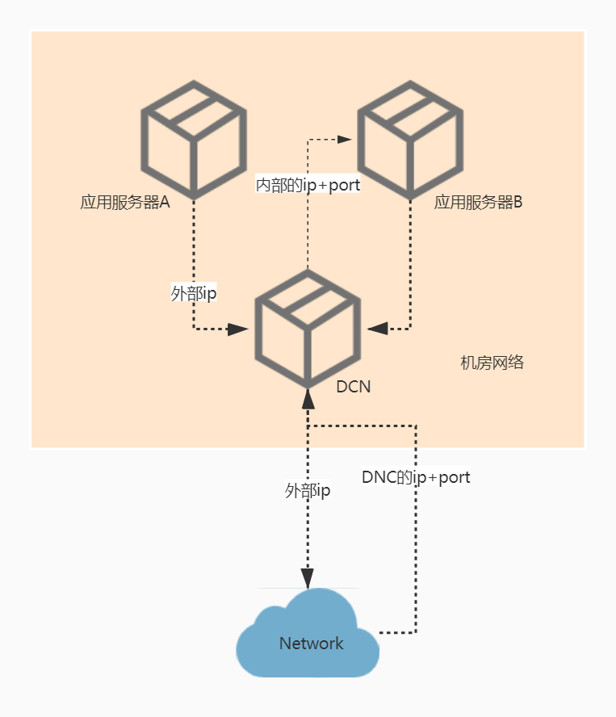
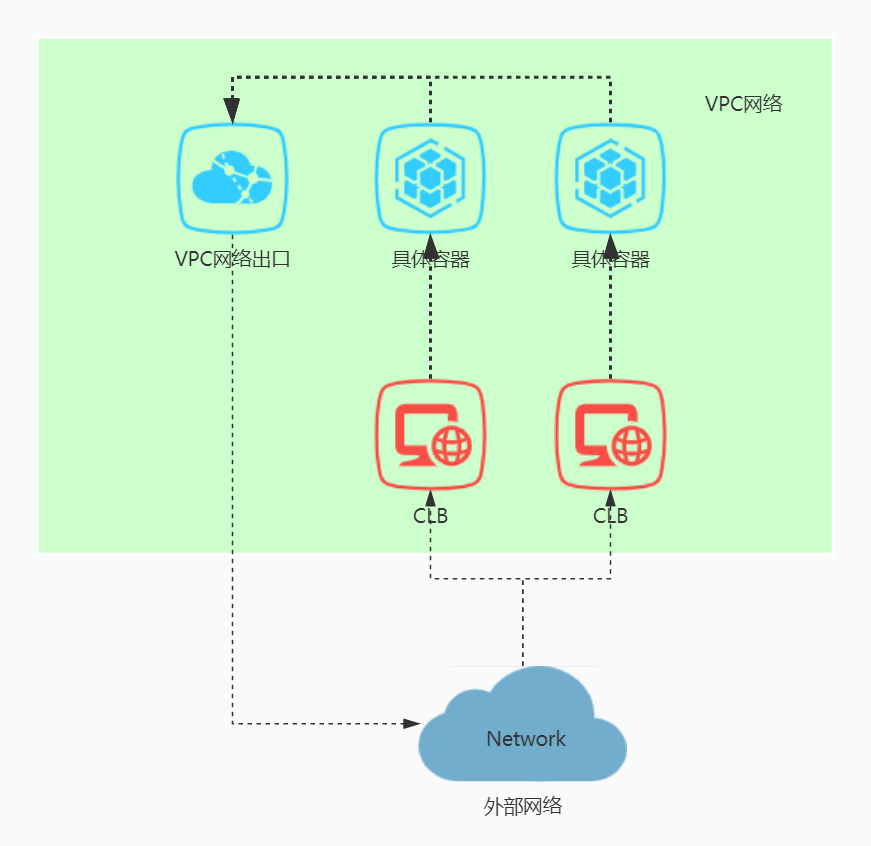
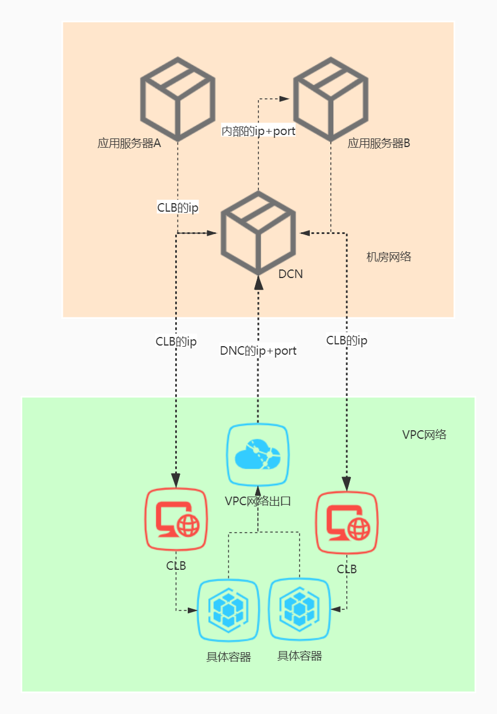

# 打网经历

## 网络环境说明

### 机房环境

* 机房环境，内网环境的应用服务器，无法访问外网环境，也无法被外网环境访问；
* 如果需要访问外网环境或被访问，需申请DCN；
* 机房服务通过DCN地址访问外网；外部服务通过DCN地址+端口访问机房服务；



* 一个DCN地址可绑定多个内网IP，例如 Nginx集群推荐使用同一个DCN地址，数据库、MQ推荐使用独立的DCN地址；

### 云环境

* 内部使用VPC虚拟网络，内部节点是IP以192.168开头的子网络；
* VPC提供一个物理出口IP和CLB地址作为入口IP；外网通过CLB地址（VPC入口）访问云环境资源；



## 打网步骤

* 云环境访问机房，VPC访问 DCN+端口，再到 机房地址+端口；
* 机房访问云环境，机房访问 CLB，经过 DCN，再到 CLB；



详细步骤：

* 检查机房被访问的端口，是否正在被监听 `lsof -i:{port}` ；
* 检查能否访问 DCN+端口，`telnet {ip} {port}` ；
* 检查机房到CLB网络通不通，`ping {ip}` ；
* 如果不通，查看路由信息，`traceroute {ip}` ；

命令总结：

* **ping：**检查源主机与目的主机之间网络是否连通，使用方式：`ping {ip}`
* **traceroute：**查看源主机与目的主机之间路由信息，使用方式：`traceroute {ip}`
* **telnet：**检查目的主机端口是否开放，使用方式：`telnet {ip} {port}`
* **lsof：**检查本地主机端口是否开放，使用方式：`lsof -i:{port}`

## 命令详解

显示本机网络信息：lsof、netstat、ifconfig

测试网络连通性：ping、traceroute、tracert、telnet

### lsof

**lsof命令**用于查看你进程开打的文件，打开文件的进程，进程打开的端口\(TCP、UDP\)。找回/恢复删除的文件。是十分方便的系统监视工具，因为lsof命令需要访问核心内存和各种文件，所以需要root用户执行。

```bash
# 本次学习的实践，-i<条件>：列出符合条件的进程。（4（ipv4）、6（ipv6）、协议、:端口、 @ip ）
lsof -i4
COMMAND   PID  USER   FD   TYPE     DEVICE SIZE/OFF NODE NAME
sshd    11467  root    3u  IPv4  436775553      0t0  TCP *:ssh (LISTEN)

lsof -i6
COMMAND   PID  USER   FD   TYPE    DEVICE SIZE/OFF NODE NAME
mysqld  18902 mysql   32u  IPv6 436781092      0t0  TCP *:33060 (LISTEN)

lsof -itcp
COMMAND   PID  USER   FD   TYPE    DEVICE SIZE/OFF NODE NAME
mysqld  18902 mysql   32u  IPv6 436781092      0t0  TCP *:33060 (LISTEN)

lsof -i:3306
COMMAND   PID  USER   FD   TYPE    DEVICE SIZE/OFF NODE NAME
mysqld  18902 mysql   34u  IPv6 436781097      0t0  TCP *:mysql (LISTEN)

lsof -i@127.0.0.1
```

> 详细资料：[https://man.linuxde.net/lsof](https://man.linuxde.net/lsof)

### netstat

查看本机的端口开放情况，除了**lsof**，还能使用**netstat命令**。打印Linux中网络系统的状态信息，可让你得知整个Linux系统的网络情况。

`netstat -atpn | grep -i 8080` ，查看该机器的8080端口是否开放；

* -a,-t是规定范围，-a：显示所有连线中的Socket；-t：显示TCP传输协议的连线状况；
* -p,-n是显示的信息，-p：显示正在使用Socket的程序识别码和程序名称；-n：直接使用ip地址，而不通过域名服务器；
* grep -i：过滤，-i忽略大小写；

> 详细资料：[https://man.linuxde.net/netstat](https://man.linuxde.net/netstat)

### ifconfig

配置和显示Linux内核中网络接口的网络参数。

如果通过ifconfig配置网卡信息，重启后修改的配置会消失；修改网卡的配置文件才能持久化保存。

```bash
# linux
ifconfig
# Microsoft
ipconfig /all
```

> 详细资料：[https://man.linuxde.net/ifconfig](https://man.linuxde.net/ifconfig)

### ping

**ping命令**用来测试主机之间网络的连通性。执行ping指令会使用ICMP传输协议，发出要求回应的信息。

### traceroute

**traceroute命令**用于追踪数据包在网络上的传输时的全部路径；默认发送的数据包大小是40字节，默认每个网关发送三个数据包。

探测数据包向每个网关发送三个数据包后，网关响应后返回的时间；如果用`traceroute -q 4 192.168.0.0`，表示向每个网关发送4个数据包。

> 详细资料：[https://man.linuxde.net/traceroute](https://man.linuxde.net/traceroute)

```bash
# linux
traceroute -d {ip}
# Microsoft
tracert -d {ip}
tracert -vpn-instance DCN-B -a {sourceIP} {targetIP}
```

### telnet

Telnet协议是[TCP/IP协议](https://baike.baidu.com/item/TCP%2FIP协议)族的一员，原本用于登录远程主机，连接后在终端输入的命令，会直接在服务器执行。

因为Telnet协议采用明文传送报文，安全性不好，很多Linux服务器不开放telnet服务，而改用更安全的[ssh](http://man.linuxde.net/ssh)方式。

所以，使用`telnet {ip} {port}` 测试主机端口是否连通，需要注意主机是否开启telnet服务；

```bash
telnet 10.123.0.0 8080
Trying 10.123.0.0...
telnet: connect to address 10.0.250.3: Connection refused #如果端口无法连通，直接提示连接被拒绝
```

其他测试主机端口是否连通的命令如下，

```bash
ssh -v -p {port} {username}@{ip}
# -v 调试模式(会打印日志)；
wget {ip}:{port}
```

## 概念科普

### ICMP协议

ICMP（Internet Control Message Protocol），网络控制报文协议，是 TCP/IP 模型的网络层协议一种，基于 IP协议实现。

用于监控[网络通](https://baike.baidu.com/item/网络通)不通、[主机](https://baike.baidu.com/item/主机/455151)是否可达、[路由](https://baike.baidu.com/item/路由/363497)是否可用等网络消息；

ping和 traceroute（tracert） 都利用 ICMP 协议实现，ping 用来测试网络可达性，traceroute 用来显示到达目的主机的路径。它们是把网络控制协议在实际网络管理使用的典型例子。

### VPC

虚拟私有云（Chinaunicom Virtual Private Cloud），为云容器构建隔离的、用户可自主配置和管理的虚拟网络环境；定义业务安全组、IP地址段、带宽等网络特性。

### CLB

云负载均衡器（Cloud Load Balance），为VPC网络内的云容器实例提供流量分发的负载均衡服务。

在负载均衡器上添加多个后端云容器实例。负载均衡器会通过服务发现并屏蔽有故障的云容器实例，并将流量转发到其他正常运行的后端云容器实例上，确保业务不中断。

### DCN

DCN，Data Communication Network，数据通信网；是一种支持网络七层协议栈中第一层（物理层）、第二层（[数据链路层](https://baike.baidu.com/item/数据链路层/4329290)）和第三层（网络层）功能的网络。

主要作用：传递网管信息的网络；承载管理信息和分布式信令消息。

主要组成节点：SDH网元（实际是SDH设备的主控板或主控单元）、路由器、网络交换机、HUB等。

> 详细资料：[数据通信网络\_百度百科](https://baike.baidu.com/item/%E6%95%B0%E6%8D%AE%E9%80%9A%E4%BF%A1%E7%BD%91%E7%BB%9C/22300054?fromtitle=DCN&fromid=5066537)
>
> [DCN\_通信百科](http://baike.c114.com.cn/view.asp?id=1358-4A3D59EB)


