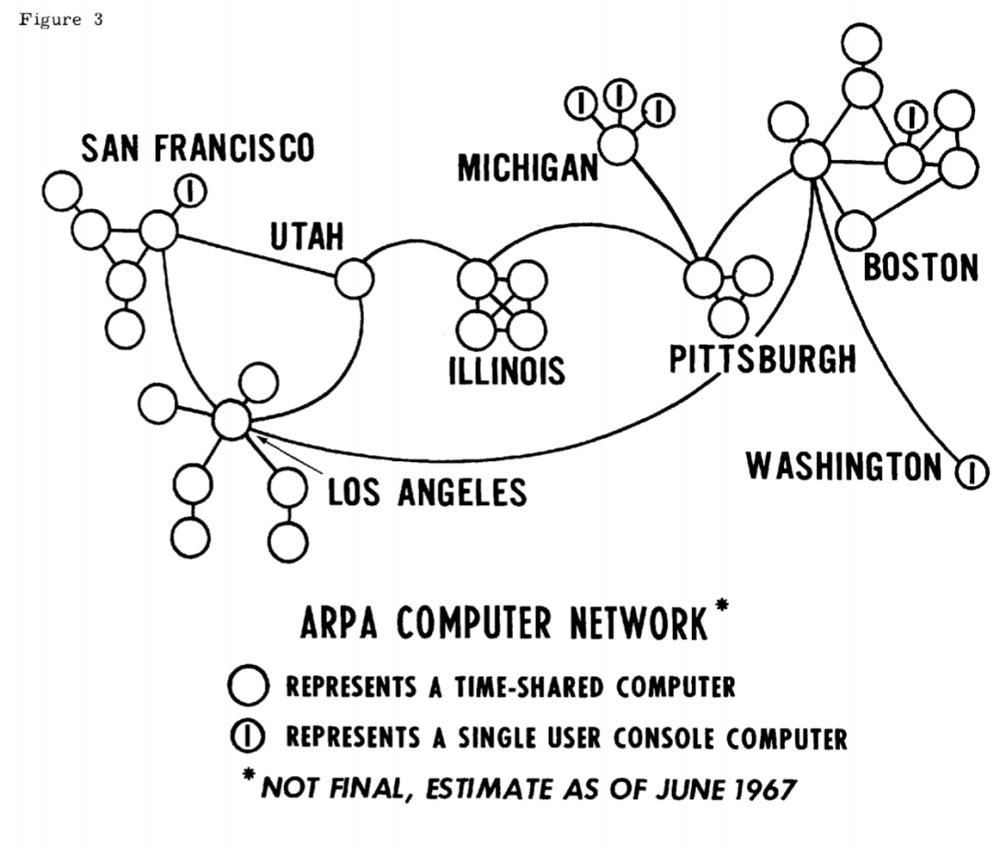
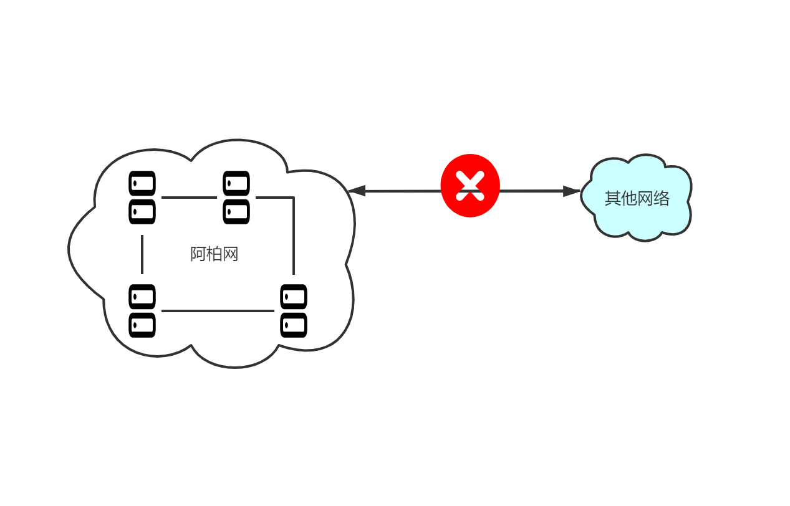

# 服务网格是怎么来的？

## 阿柏网

​ 阿柏（ARPA），美国高级研究计划局（ **A**dvanced **R**esearch **P**roject **A**gency）的缩写；美国冷战时期为了防止单个作战系统被摧毁造成瘫痪，而发起的科研计划。

​ 1969年11月，拉里·罗伯茨建立”阿柏网“，由四所大学的大型计算机组成，一年后节点增至15个，且平均每隔二十天就有一台大型计算机接入；“阿柏网”就是现代互联网的雏形。 

​ 但是，“阿柏网”需要大量控制逻辑（丢包、乱序、重试等问题）和标准化的机器设备，才能进行交流；当时有两个重要的网络需要连接，卫星网络（SAT NET）和基于夏威夷的分组无线业务的ALOHA网（ALOHA NET）。

“阿柏网”主要问题：

* 不同网络的无法交流，交流方式不统一；（网络异构）
* 机器自行处理网络通信问题，丢包、乱序、重试等；（机器异构）

## TCP/IP

​ 1973年，文顿·瑟夫和罗伯特·卡恩，发明了[传输控制协议](https://zh.wikipedia.org/wiki/傳輸控制協定)（TCP）和[互联网协议](https://zh.wikipedia.org/wiki/網際網路協定)（IP），被称为“互联网之父”。

* TCP是面向连接的、可靠的、基于[字节流](https://zh.wikipedia.org/wiki/字節流)的[传输层](https://zh.wikipedia.org/wiki/传输层)通信协议；
* IP定义了寻址方法和数据报的封装结构；

TCP/IP 解决了“阿柏网”的主要问题：

* 不同类型网络的互联（通过统一的协议）
* 不同机器的互联（通过协议解决传输问题，保证可靠性）

## 单体架构

早起的WEB应用中，重点是使用应用层协议，实现业务逻辑，每个服务均是单体，通过IP寻址实现交互。

单体架构的痛点：

* 单体性能差；
* 垂直扩展，性能有限制、成本有限制；

## 单体集群

​ 随着网络发展，单体必然无法满足不断增长的访问量；

​ 通过水平扩展进行流量均衡：多个单体组成集群，使用负载均衡分摊流量；例如通过nginx反向代理，负载均衡多个无状态的单体服务。

主要问题是：

* 单体服务的代码耦合问题；
* 部分热点功能的弹性扩展；
* 调用链监控问题；
* 需手动删除宕机服务，运维复杂；

## 微服务

​ 部分业务量出现井喷现象，水平扩展单体服务必造成资源的浪费，且庞大的单体耦合严重，扩展性和维护性非常差。

​ 按功能模块切分为多个微服务，每个微服务内嵌一个代理完成服务注册、发现、调用的逻辑；

* 单体拆分为多模块；
* 服务注册、服务发现、服务调用；

主要问题是：

* 微服务与代理（dubbo、SpringCloud）耦合；
* 不支持异构语言间的调用；
* 服务调用协议必须一致；

## 服务网格

每个主机部署一个【代理进程】，代理进程负责主机中，所有微服务的注册、发现、调用及负载均衡。

​ 像这种模式称为“sideCar”，即“边车模式”；

​ “边车”，是指摩托车，驾驶位置旁边挂着一个拖斗；类似微服务旁边挂一个代理进程，所以称为“边车模式”。

​ ServiceMesh 就是采取sideCar部署服务提供者和服务消费者。服务通过sideCar调用和向外暴露，sideCar则负责注册、发现、调用、负载均衡、熔断、限流等服务治理功能。

> 服务网格中，服务实例及其sidecar代理被称为构成数据平面，其中不仅包括数据管理，还包括请求处理和响应。服务网格还包括一个用于管理服务之间交互的控制平面，这些交互由它们的sidecar代理协调。服务网格架构有几个选项: [Istio](https://zh.wikipedia.org/w/index.php?title=Istio&action=edit&redlink=1)、[Linkerd](https://zh.wikipedia.org/w/index.php?title=Cloud_Native_Computing_Foundation&action=edit&redlink=1)、[Consul](https://zh.wikipedia.org/w/index.php?title=Consul_%28software%29&action=edit&redlink=1)和其他许多服务网格景观。服务网格管理平面[Meshery](https://meshery.io/)提供跨服务网格部署的生命周期、配置和性能管理。

参考资料：

wiki/微服務\#Service\_mesh：[https://zh.wikipedia.org/wiki/%E5%BE%AE%E6%9C%8D%E5%8B%99\#Service\_mesh](https://zh.wikipedia.org/wiki/%E5%BE%AE%E6%9C%8D%E5%8B%99#Service_mesh)

