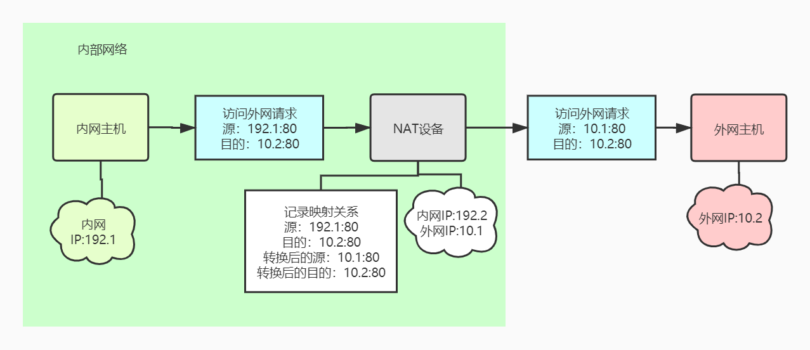
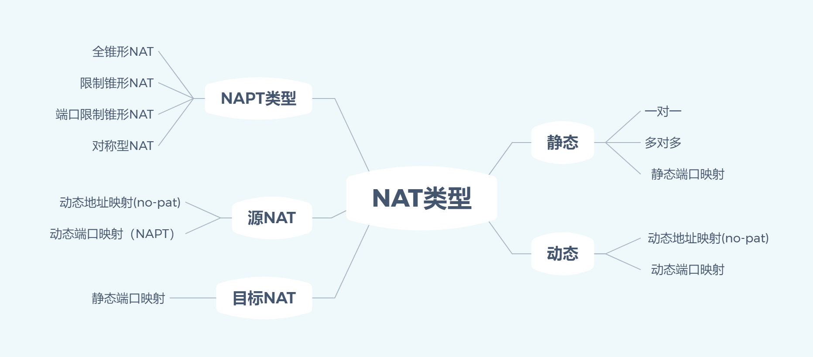

# NAT也有大学问

## 概述

我们使用的IPv4地址大小是32位（4个字节），因此IPv4地址只有4,294,967,296（232）个，即最多只有42亿个地址；如今，IPv4地址早已耗尽， **NAT**协议就是为了解决 IPv4 地址耗尽的问题。

**NAT**\(Network Address Translation，网络地址转换\)，通过将内网地址和端口号，转换为公网地址和端口号，减少公网IP的使用；例如在内网的出口部署NAT，请求报文进入NAT时将源IP替换为NAT的公网IP，服务端收到的报文源IP就是NAT的公网IP；服务端向NAT返回响应，NAT将目的IP替换为内网主机IP；通过这种地址转换，内网大量的主机只需要一个公网IP；

> 注意：单个ip的nat数量
>
> 协议× 源地址×源端口×目的地址×目的端口 = 2 \* 1 \* 2^16 \* 2^32 \* 2^16 = 3.68934881e+019 个连接\(理想状态\)
>
> 最差的情况，所有的用户都访问同一个IP地址的同一协议的同一端口，则：
>
> 协议×源地址×源端口×目的地址×目的端口 = 1 \* 1 \* 2^16 \* 1 \* 1 = 65536个连接（最糟糕情况）。

所以 NAT 解决了公网IP耗尽问题；局域网安全问题（转换隐藏源地址）；

## NAT特点

### NAT 的工作特点

1. 网络被分为内网和公网两个部分，NAT网关设置在内网到公网的路由出口位置，双向流量必须都要经过NAT网关；
2. **公网只知道NAT网关的公网地址**，不知道内网主机地址，无法主动访问内网主机；
3. NAT网关在两个访问方向上完成两次地址的转换或翻译，出方向做源信息替换，入方向做目的信息替换；
4. NAT网关的存在对通信双方是保持透明的；
5. NAT网关会维护一个**地址关联表**，关联表中会记录源IP、目的IP、连接协议类型、传输层源端口、目的端口，以及转换后的源IP、源端口，目的IP、目的端口信息；

### **NAT的缺点**

由于 NAT/NAPT 都依赖于自己的转换表，因此会有以下的问题：

* **外部无法主动**与 NAT 内部服务器**建立连接**，因为 NAPT 转换表没有转换记录。
* 转换表的生成与转换操作都会产生**性能开销**。
* 通信过程中，如果 NAT **路由器重启**，所有 TCP 连接都被重置。
* **对等网络传输需穿透NAT**：IP协议的定义中，在理论上，具有IP地址的每个站点在协议层面有相当的获取服务和提供服务的能力，不同的IP地址之间没有差异。但NAT工作原理破坏了这个特征，如需实现真正意义上的对等网络传输，则需要穿透NAT。
* 应用层需保持UDP会话连接：由于NAT资源有限，会根据一定规则回收转换出去的资源\(即ip/port组合\)，UDP通信又是**无连接**的，所以基于UDP的应用层协议在无数据传输、但需要保持连接时需要发包以保持会话不过期，就是通常的**heartbeat**之类的。

### NAT 穿透技术

 **NAT穿透**：客户端主动从 NAT 设备获取公有 IP 地址，然后自己建立端口映射条目，然后用这个条目对外通信，不需要 NAT 设备进行转换。（注意，这些都是主机自动完成的。）

 在 NAT 穿透技术中，主机处于主动地位，它明确知道 NAT 设备要修改它外发的数据包，于是主动建立映射，与以前由 NAT 设备来建立映射不同。

## NAT类型

NAT作为一个IP层业务特性，在产品实现中与防火墙、会话管理等特性有紧密联系，这是因为NAT判断一个进入设备的报文是否需要NAT处理，判断报文是否为一个新的连接，都需要通过匹配访问控制列表规则和查询会话关联表进行判断。为了满足不同应用场景的NAT需求， NAT的管理界面可提供用户多种配置策略。按照NAT的具体工作方式，又可以做如下分类。

### 静态NAT

#### 一对一NAT

* NAT把**一个私网IP**和**一个公网IP**做静态关联，即一台内网主机占用一个公网IP且不变；
* 该方式明显不能节省公网IP，主要是因为网络安全，如隐藏内网主机IP，或者一些特殊的网络要求，如IP地址重叠等；

#### 多对多NAT

* **一段私网IP**与**一段公网IP**静态关联，工作原理与一对一NAT相同。

#### 静态端口映射

* 通过静态配置，把一个固定的**私网IP和端口**关联到一个**公网IP和端口**上。不需要内网主机首先发出报文；这种方式适用于在NAT网关上把外部请求映射到一台内部主机上。

### 动态NAT

#### 动态地址映射\(no-pat\)

* 动态替换地址，不替换端口。内网经过NAT访问公网时，NAT网关会检查私网IP是否已经关联公网IP。
* 如果已经存在映射，则按照转换表直接替换IP，不修改上层协议（TCP协议的端口）。
* 如果不存在，则在空闲的公网IP池中占用一个IP，并写入关联表，以后按照这个关联关系进行转换。当这个私网主机发起的所有对外访问均关闭或超时后，回收公网IP。

这种方式可以理解为内网共享一个公网IP池并进行抢占。当公网IP被抢占完，新连接将无法建立。

#### 动态端口映射（NAPT/PAT）

* 动态替换地址和端口。内网访问外网的报文，替换**源地址和端口**；反向报文替换**目的地址和端口**。
* 将内网IP和端口动态转换为公网IP和端口，实现公网IP复用，且配置简单，被称为EasyIP。

### 目的NAT

* **基于目的IP地址的NAT**：公网访问私网，源IP不变，只转换目的IP；通过**静态端口映射NAT**实现。

常用的业务场景有：

* **内网提供外网服务时，配置NAT Server**

公网主机只能通过一个公网地址来访问内网主机，通过**目的NAT**将公网主机访问的公网IP自动转发给**内网主机**（公网访问 NAT公网IP+端口，目的IP会转换为内网IP，端口不变）。

* **终端到WAP网关的NAT设备**

移动终端访问无线网络时，如果其访问的WAP网关地址与所在地运营商的WAP网关地址不一致，可以在WAP网关前部署NAT设备，并配置目的NAT，自动将发往错误WAP网关地址的报文自动转发给正确的WAP网关。

### 源NAT

* **基于源IP地址的NAT**：私网访问公网，只转换源IP，目的ip不变；

常用的业务场景有：

* 通过将内部主机的私有IP转换为公有IP，使一个局域网中的多台主机使用**少数公有地址**访问外部资源；
* 隐藏内部局域网的主机IP地址，起到**安全保护**的作用；

实现方式有：

*  **动态地址映射\(no-pat\)**

配置No-pat参数后，NAT设备将不转换端口，从公网IP池并进行抢占，并**转换源地址IP为公网IP**，当公网IP被抢占完，新连接将无法建立。

* **动态端口映射（NAPT/PAT）**

在进行NAT转换IP地址的同时，还对端口号进行转换，可实现多个内网主机共用一个公网IP。

### NAPT

**NAPT**（Network Address Port Translation），也叫 **PAT**（Port Address Translation）；

* 改变外出数据包的源IP地址和源端口，采用端口多路复用的方式。内部网络的所有主机可共享一个公网IP地址，实现外网访问，最大程度节约IP地址资源。

1. 全锥形NAT
2. 限制锥形NAT
3. 端口限制锥形NAT
4. 对称型NAT

### 应用场景总结

* 源NAT：内网访问外网；
  * 如果是**动态地址映射\(no-pat\)**，需要多个外网IP；
  * 如果是**PAT**，只需将多个内网主机IP与一个NAT的外网IP绑定。
* 目的NAT：外网访问内网，需要将 内网主机的IP和端口，NAT的外网IP和端口进行绑定；外网主机直接访问NAT的IP和端口。
* 静态NAT：一个内网主机绑定一个公网IP，隐藏内网主机IP保证安全。

> 注意：
>
> 一个NAT设施/路由，可以配置多种NAT；例如同一台NAT路由，可以同时配置 源NAT 和 目的NAT；
>
> 参考资料：[NAT详解：基本原理、穿越技术\(P2P打洞\)、端口老化等](http://www.52im.net/article-64-1.html)
>
> [https://blog.51cto.com/hzcto/2418606](https://blog.51cto.com/hzcto/2418606)
>
> [https://forum.huawei.com/enterprise/zh/thread-262551.html](https://forum.huawei.com/enterprise/zh/thread-262551.html)

