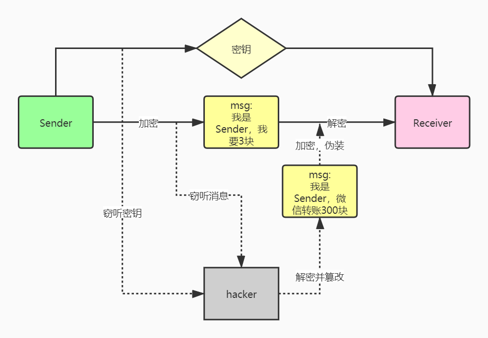
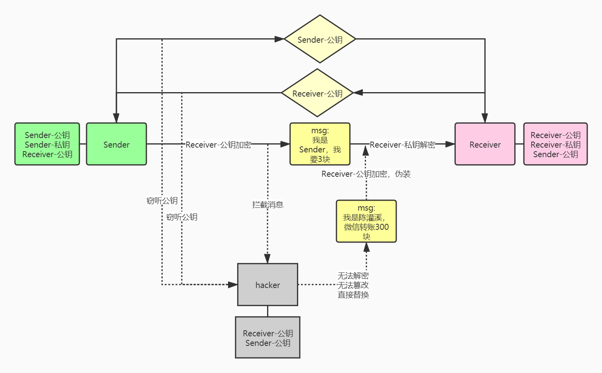

# 数字签名和数字证书

准备整理Https的时候，发现数字签名和数字证书的概念不清晰，特此学习

## 1 加密

**加密**是，把**明文数据**通过特殊算法进行处理，变成不可读的数据，即**密文**；

我们常用的编码技术：Base64, MD5, SHA, AES, RSA, SM4；只有AES，RSA，SM4是加密技术；

快速区分编码是否加密：编码后的数据能否通过**密钥**还原，可以则是加密技术；

**MD5** 是对数据进行有损压缩，无论数据多长，1KB 还是 1G，都会生成固定 128 位的散列值，所以无法对编码后的数据进行还原，即**不可逆**；而且相同的数据多次计算值不变，即**单向恒定性**。多用于文件完整性验证、口令加密及数字签名。

**BASE64** 编码不需要密钥，且编码后的字符串可以被任何人解码。常用来做转码，把二进制字节序列转化为 ASCII 字符序列。

### 1.1 对称加密

加密和解密使用同一个**密钥**；（AES，SM4）

### 1.2 非对称加密

加密和解密使用不同的密钥，分别叫**公钥**，**私钥**；（RSA）

公钥是公开给所有人使用，私钥必须自己保管；

公钥加密只能通过私钥解密；私钥签名只能通过公钥验证签名；

## 网络传输方式

### 2 明文

消息在网络中的传输方式，普遍是明文传输，像http、ftp、tcp/ip、telnet，可以通过抓包等方式轻易获取里面的信息；所以明文传输容易出现以下几种安全问题：

* 容易获取具体内容（**窃听**）
* 修改消息内容（**篡改**）
* 冒充回复者发送消息（**伪装**）

### 3 对称加密

通过对称加密对内容进行加密，可防止窃听（缺少密钥）；

但是当传输双方交换对称加密的密钥时，是明文交换，一样存在泄露问题；当密钥泄露时，该方式和明文传输一样危险；

### 4 非对称加密

为了解决消息传输的**窃听**问题，我们使用非对称加密的方式，例如https；

client和server都用对方的**公钥**进行加密，加密的内容只能由对方的**私钥**解密；这就解决了在交换密钥和消息传输时，消息泄露的问题（**防窃听**）

### **4.1 如何防篡改和伪装**

因为**公钥**是公开的，所以攻击者可以截取消息，替换为自己想发送的内容；

所以，server要验证消息是否来自client，需要一个client独有的证明，且能通过证明验证是client的；

### **4.2 数字签名**

什么东西是client独有呢？client的私钥。

client可以使用私钥，对消息进行编码得到**数字签名**，这个过程就叫**签名**；

server使用client的公钥验证签名是否正确，即**验签**；

（流程图）

> **对【消息摘要】进行签名**
>
> 非对称加密依赖于复杂的数学运算，包括大数乘法、大数模等等，如果数据量还大，耗时将非常长。所以会先将原数据进行 Hash 运算，得到 Hash 值，即**摘要**。
>
> 生成摘要的算法一般使用 MD5 ，输出固定为 128 位大小。**摘要**根据内容产生，只要内容改变，计算出的摘要也会改变，且 MD5 生成的摘要是不可逆转的。
>
> **为什么摘要需要不可逆转？**
>
> 因为所有人都可以通过公钥获得摘要，如果摘要可逆转，那就可以轻松获得消息内容了。
>
> **接收者如何使用【签名】？**
>
> * 接收者获得**签名**后，使用发送者的公钥进行解密，即**验签**，得到摘要；
>   * 如果验签失败，证明发送者身份有问题；
> * 使用相同的算法，对消息进行编码生成**摘要**，与签名中的摘要对比；
>   * 如果摘要不相同，证明数据被篡改；

所以，通过**数字签名**，可以验证发送者的身份，保证数据不被篡改。

但是，如果接收者在接收**发送者公钥**的时候，被截取并篡改了呢？这会导致黑客被认为是发送者，而发送者被认为是冒充的黑客。

### **4.3 数字证书**

如何保证公钥不被篡改，不被伪装呢？

我们需要第三方机构对公钥进行数字签名，即**数字证书**；

第三方机构，证书颁布机构（CA）会将：证书颁布机构的信息、有效期、需要保护的公钥、持有者\(subject\)等信息用 CA 的私钥进行签名。

这些签名的信息，加上数字签名，就是**数字证书**。

* 发送方在CA申请数字证书，并交给接收方；
* 接收方使用CA的公钥进行验签，保证发送方的公钥不被篡改和伪装。

#### **4.3.1 电脑自带的证书**

CA的公钥如何获取呢？

CA 是有层级关系的，下级 CA 的证书需要由上级 CA 签名。CA 的公钥通过上级 CA证明获得，所以电脑必须安装 根证书。

根证书是自签的，无法通过签名确认根证书的可靠性。而根证书的安装，是由操作系统和浏览器预装的。

#### **4.3.2 浏览器提示证书不可信**

浏览器有时会提示 “证书不可信” ，为什么呢？

* 浏览器的 CA 证书无法认证该网页的证书；
  * 网页的证书没有经过 权威CA 认证，无法使用浏览器内置 CA 证书认证。
  * 可以安装网页提供的用于校验证书的 CA 根证书；
  * 或者坚持访问，但是访问时的公钥不受数字证书的保护；
* 证书过期
  * 证书的内容包含有效期，一般是一到两年；
* 证书部署错误
  * 服务器的证书部署错误，例如证书的持有人信息与实际域名不匹配。

> 参考资料
>
> [https://www.zhihu.com/question/52493697](https://www.zhihu.com/question/52493697)

