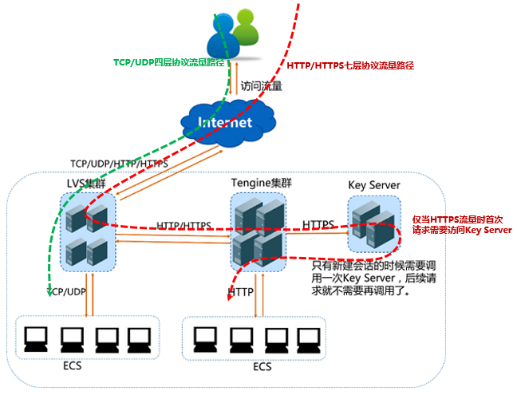
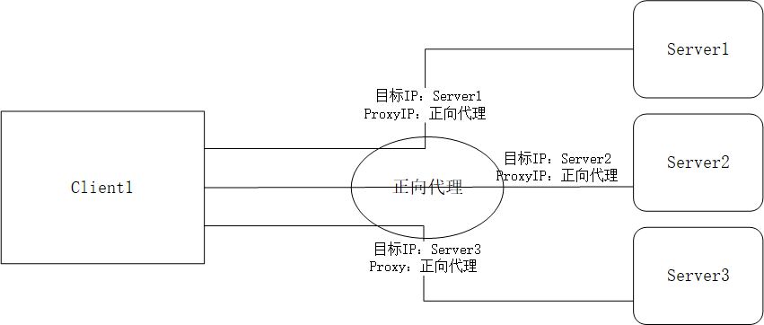
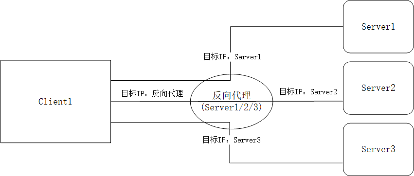

# 代理、网关

CLB/SLB，即云环境-负载均衡。作为流行云原生的2021年，经常接触云环境的各个组件产品。借实际使用中踩坑的例子，深入了解CLB产品。

## 踩坑CLB

1.长链接问题：CLB的http监听代理，默认设置30s超时时间。若需要使用长链接请求，选择tcp监听代理。

2.源IP会话保持：CLB的tcp监听代理，设置【源IP会话保持】监听策略，无法保持会话的源IP不变。若需要使用【源IP会话保持】，选择http监听代理。

## CLB实现原理

CLB作为云环境中计算资源的负载均衡产品，是反向代理的一种实现。他分为四层监听（传输层，tcp、udp协议），七层监听（应用层，http、https协议）。

* 四层监听，通过 LVS（Linux Virtual Server） + keepalived实现
* 七层监听，通过 nginx、HAproxy 等实现反向代理。

### CLB架构



* LVS集群：
* nginx集群：
* Key server：

### 四层反代 vs 七层反代

**四层反向代理**，记录请求的源ip和port，再转发内部服务器集群。回包时把服务器的内部ip改写为反向代理的对外ip。

四层代理由于只对OSI模型的传输层做处理，无论上层协议是什么，一律改写、转发。因此实现简单、效率高，但功能较少。软件实现有linux自带的 LVS，硬件实现有 F5产品。

**七层反向代理**，是这么实现的。

七层代理由于对OSI模型的应用层做处理，所以除了更改 ip、port，还可以根据数据包的应用层首部信息，实现更多功能。例如根据不同域名转发不同 ip 或 port、动静分离等。

七层反向代理的具体实现和协议类型有关，http/https有 nginx 和 HAproxy。

HAproxy 即可实现4层也可实现7层代理，负载均衡的种类更多，性能更好。

nginx只实现7层代理，但实现功能多，例如负载均衡、动静分离、web Server、限流等。且案例多、社区活跃。

F5，负载均衡软硬一体的公司/产品。用于反向代理负载均衡。

## 代理

### 正向代理

正向代理，是中介，是客户端访问所有服务的中介，是与正向代理关联的客户端访问Server的中介/转发者。（客户端代理）

> From Wikipedia
>
> a forward proxy, which is an intermediary for its associated clients to contact any server.
>
> a reverse proxy is an intermediary for its associated servers to be contacted by any client.



正向代理图例说明：Client1指定访问Server1，并指定【正向代理】帮助Client1转发访问Server1。

#### 正向代理适用场景：

服务器处于内网，且无公网ip，希望与外网进行http/https通信，只能通过nat设备（SNAT）或proxy两种方式。（nat服务器有网段限制）

#### 代理服务器（正向）例子：

客户端要访问Internet，需要通过代理服务器访问。即，客户端只能通过访问局域网内，甚至是同服务器中的nginx转发访问Internet。

客户端通过HTTP访问代理，代理通过监听不同的端口，分别处理HTTP和HTTPs请求。

```bash
server {
    resolver 114.114.114.114; #指定DNS服务器
    listen 80;
    location / {
        proxy_pass http://$host$request_uri; #代理服务器的协议（http）和请求地址
        proxy_set_header HOST $host;
        proxy_buffers 256 4k;
        proxy_max_temp_file_size 0k;
        proxy_connect_timeout 30;
        proxy_send_timeout 60;
        proxy_read_timeout 60;
        proxy_next_upstream error timeout invalid_header http_502;
    }
}
server {
    resolver 114.114.114.114; # 指定DNS服务器
    listen 443;
    location / {
        proxy_pass httpss://$host$request_uri; #代理服务器的协议（https）和请求地址
        proxy_buffers 256 4k;
        proxy_max_temp_file_size 0k;
        proxy_connect_timeout 30;
        proxy_send_timeout 60;
        proxy_read_timeout 60;
        proxy_next_upstream error timeout invalid_header http_502;
    }
}
```

#### 测试正向代理服务器：

```bash
curl -I --proxy 192.168.0.1:80 www.baidu.com

curl -I --proxy 192.168.0.1:443 www.baidu.com

# 全局代理
vi /etc/profile
export http_proxy='192.168.0.1:80'
export https_proxy='192.168.0.1:443'
export ftp_proxy='192.168.0.1:80'

curl -I www.baidu.com:80
curl --head www.baidu.com:443
```

> 使用正向代理服务器时的全局代理问题：
>
> /etc/hosts文件设置的域名解析ip不生效。因为代理的域名解析由代理服务器配置。

### 反向代理

反向代理，是中介，是服务端被所有客服端访问的中介，是与反向代理关联的Server被所有client访问的中介/转发者。（服务端代理）



反向代理图例说明：Client1访问【反向代理】，【反向代理】代理3个Server，并将该请求转发其中一个代理的Server。

#### 反向代理适用场景

例如反向代理了三个Server，只有客户端访问这三个Server，代理服务器才会进行代理。

#### 代理服务器（反向）例子：

反向代理服务器一般架设在内网入口，实现动静分离、负载均衡等。

```bash
upstream {
    server 192.168.0.1 weight=1 max_fails=1 fail_timeout=30;
    server 192.168.0.2 down;
}
server {
    listen       10000;
    server_name  localhost;
    #拦截请求Server
    location /{
        proxy_pass http://webserver;
    }
    
    #拦截静态资源
    location ~ .*\.(html|htm|gif|jpg|jpeg|bmp|png|ico|js|css)$ {
        root /Usr/static;
    }
}
```


### 虚拟私有网络

Virtual Private Network\(VPN\)

#### 代理模式

正向代理，数据包经过代理VPN后，修改IP地址。

#### 隧道模式

隧道技术（gre、ipsec等技术），不修改数据包的ip，会给数据包加一层新的ip。隧道VPN，为数据包加一层新头部的方式，伪装流量穿过互联网。

#### 网关

网关设备，就是一台单纯的转发设备，通过路由表查询目的地如何走，然后把这个数据包转发出去，转发的过程并不修改数据包的IP地址。

防火墙


## 扩展

### MySQL的Sharding分布式方案

> 1.反向代理分片（proxy sharding）：流行产品有mycat、drds、cobar、 ShardingSphere-Proxy，一般是使用 mysqlproxy 或 ameoba 开源改造。优点是mysql协议基本兼容。缺点是分库分表算法差，业务加大量配置麻烦，产品额外消耗资源。
>
> 2.jdbc层的分片中间件（jdbc sharding框架）：流行产品有ShardingSphere-JDBC。优点是性能损耗低，兼容任意数据库协议。缺点是与编程语言（Java）强绑定。
>
> 3.mysql引擎层面sharding：流行产品有mysql的ndbcluster和fabric，通过mysql的协议层和计划生成。优点是百分百支持原生协议层，事务用mysql xa支持。缺点是单机引擎，不支持大数据sql。
>
> ORM框架：对象映射框架
>
> DAO层：数据访问对象层
>
> jdbc：java数据库连接工具
>
>  ShardingSphere：一套开源的分布式数据库中间件解决方案组成的生态圈,它由_Sharding-JDBC_、_Sharding-Proxy_和_Sharding-Sidecar_\(计划中\)这3款相互独立的产品组成。均提供标准化的数据分片、分布式事务和数据库治理功能。分别针对Java同构、异构语言、容器、云原生等应用场景。
>
> sharding模式：“share-nothing”，分片数据库之间没有共享任何数据。缺点是：
>
> 1.  分片查询必须使用sharding key，不带分片键sharding key则全表扫描。
> 2.  建表必须指定sharding key
> 3. 事务默认仅限单库。跨库事务需走分布式二阶段事务的扩展，且不支持 read repeated 和 串行。
> 4. 扩容时影响 sharding key计算，需停止写入。
> 5. proxy中间件的资源浪费，单点可用性问题，性能瓶颈问题。
> 6. SQL使用限制：
>
>    **SQL大类限制**
>
>    * 暂不支持自定义数据类型或自定义函数。
>    * 暂不支持存储过程、触发器、游标。
>    * 暂不支持临时表。
>    * 暂不支持BEGIN…END、LOOP…END LOOP、REPEAT…UNTIL…END REPEAT、WHILE…DO…END WHILE等复合语句。
>    * 暂不支流程控制类语句（如IF或WHILE等）
>
>    **限制**
>
>    * DDL
>    * DML

### 获取客户端真实IP

**七层反向代理**，真实的客户端 IP 在HTTP头部的X-Forwarded-For字段，格式如下： `X-Forwarded-For: 用户真实IP, 代理服务器1-I, 代理服务器2-IP, ...`

以 nginx 为例，安装http\_realip\_module。配置信息如下：

```text
 fastcgi connect_timeout 300;
 fastcgi send_timeout 300;
 fastcgi read_timeout 300;
 fastcgi buffer_size 64k;
 fastcgi buffers 4 64k;
 fastcgi busy_buffers_size 128k;
 fastcgi temp_file_write_size 128k;
 
 set_real_ip_from <IP_address>;
 real_ip_header X-Forwarded-For;
```

**四层反向代理**，默认源IP即为真实的客户端 IP。

若客户端IP做了NAT转换，可通过 Proxy Protocol 将原始连接信息（源IP，源端口，目的IP，目的端口）在TCP数据头中存放。


