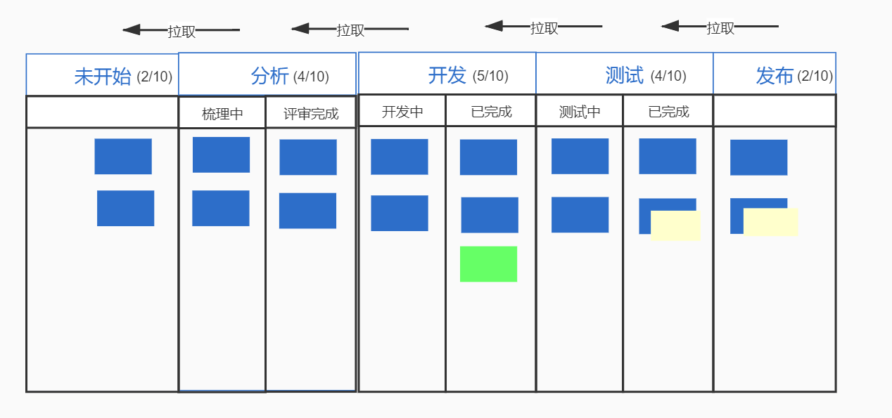

# 研发流程管理平台功能

## Kanban

**KANBAN**，是敏捷实践方法之一；

日常使用的看板，信息板、数据板、数据墙等，称为 **物理板**；

### KANBAN是什么？

* 敏捷的实践方法之一；
* KANBAN是拉动式生产，下游拉取上游的半成品继续加工；
* 最核心价值是**聚焦消除阻塞，优化整体的生产效率**；（不是为了优化资源利用，因为无法控制资源的使用效率）

### KANBAN如何实践？

* **可视化价值流**

将功能性需求、bug、技术改进等写在卡片上，这个卡片就叫KANBAN，用卡片代表需求在状态池中流转，卡片在不同**泳道**间的流动过程，表示了对应**价值加工**的过程。因此，可以直观的从状态池中发现问题（问题可视化），促使问题解决，消除阻碍价值流程的因素（阻塞）。

* **显示化流程规则**

不同泳道间设置**流转规则**，即设置需求状态流转的DOD。规则的制定应该基于团队情况，并通过全员确认，以此保证后续执行过程的顺畅，无责任推卸。

DOD：完成标准（Definition of Done），表示工作是否完成的定义；

* **限制在制品数量**

限制各阶段的在制品（需求）最大数量（包含进行中和已完成的）。

在制品小于上限，可以从上游环节拉取新的工作；若在制品达到超过上限，则不能再从上游拉取工作，形成从下游向上游的拉动机制。

* 常见的物理板可以算是简化的KANBAN流，它只包含**可视化价值流**，而**显示化流程规则**和**在制品数量的限制**并没做明确规定。

* 泳道：KANBAN流图中，每个泳道都是流程中的一个阶段，

  每个阶段就是一条泳道，制品则放在泳道中。

* 制品数量限制（WIP，Limit Work In Progress）：决定了每种情况下的工作流中可以存续的最大工作量；
* 卡片：团队需要处理的任何事。研发团队关注的是待交付的新功能，这样一般用User Story。但是要注意安高优先级将待交付的需求排序再开展工作；

### KANBAN流图的使用

* 在KANBAN管理流中，我们用不同颜色的卡片代表不同类型的价值来源，我们首先应该注意的是代表了阻塞点或者问题的卡片；当一条泳道发生堵塞时，我们应该集中团队的力量，去解决障碍，就比如上面那张图，明显看出测试的队列已经严重阻塞了，这时候我们团队应该一起去解决测试的问题，就不要再继续做其他泳道的需求了（防止过量生产）；
* 出现需要处理的一张KANBAN后，团队应该根据规则，比如根据需求价值、优先级排序，进行处理；最终形成一个稳定的输入输出节奏（需求产出和交付），

### KANBAN的适用场景

* 如果团队的需求**来源**特别多，而且需求之间没有特别大关联的时候（例如同时支持多个业务团队的时候）；
* 或者产品基本完成，剩余**维护类**需求的时候；
* 如果产品不需要有固定**发版节奏**的，也可使用KANBAN工作流。

### KANBAN 与 SCRUM

1. scrum明确定义了**团队的角色**，SM、PO、TEAM，而KANBAN中弱化角色的存在；
2. scrum对**迭代**的时间盒有明确约定：将项目周期拆分为固定时长的迭代周期，每个迭代完成一部分可交付的功能，迭代周期一般建议2-4周；KANBAN没有固定的时间盒；
3. scrum将**产品需求**拆分为用户故事，根据优先级选择迭代范围，**范围**一旦确定，尽量不发生更改；KANBAN采用拉动式生产，下游任务完成后，从上游拉取任务，生产力足够的情况下，可以随时插入新任务；
4. Scrum通过**迭代容量**间接限制在制品数量；KANBAN方法直接对同一状态同一时间内的工作**任务数量**设置限制；
5. Scrum是以价值**交付效率**作为计划和改进的依据，以迭代（sprint）数据作为依据，分析迭代的相关数据（包括生产率、完成率等）；KANBAN方法是使用生产周期作为计划和过程改进的依据。（每个需求的**交付周期**）

* scrum和kanban都是敏捷的实践方法，体现了**持续改进**的思想；都关注尽早交付价值，频繁交付价值（可用软件）；scrum中的物理板（实现部分KANBAN思想）和KANBAN board都能直观反映团队的状态，方便团队找到问题和瓶颈；

> 参考资料：[https://juejin.cn/post/6844904112836837389](https://juejin.cn/post/6844904112836837389)
>
> [https://zhuanlan.zhihu.com/p/63827651](https://zhuanlan.zhihu.com/p/63827651)

## 产品路线图

产品路线图是产品需求在时间轴上的总体视图；

使用产品路线图来对需求进行分类、排定优先级，然后确定发布时间表。

宏观的展示了产品的发展方向以及开发团队何时实现目标。

是一个动态的文档，产品负责人会在项目进行过程中根据实际情况不断更新，所以**在创建产品路线图的初期，对需求、工作量、优先级、完成时间的估算不要求也无法很精确，这些内容都是随着项目进行不断细化调整的。**

拓展：

单一产品路线图、多产品路线图

步骤：步骤1：识别分解产品需求；步骤2：产品需求归类分组；步骤3：产品需求估算排序；步骤4：确定需求时间框架；

参考资料：如何创建产品路线图/Roadmap？[http://www.woshipm.com/pmd/915091.html](http://www.woshipm.com/pmd/915091.html)

### 路线图依赖关系

## 里程碑（pingcode）

设置阶段性的里程碑有什么作用？

* 在项目实施过程中，可根据里程碑灵活**控制项目进度和节奏**；
* 让所有干系人了解项目的**进展**，到哪个阶段；

如何设置里程碑？

* 把功能完成设为里程碑，而不是以时间段来设置里程碑；
* IT项目可以分为设计、开发、单元测试、集成测试、发布等。选取每个任务的完成点设为里程碑。在每一个里程碑的时候，都要有“完成”的**交付物**。
* 设定里程碑时，建议团队一起讨论在哪些点设立里程碑，同时要确认整个团队对每个里程碑和最终完成有**统一定义**。

## 燃尽图（burn down chart）

* 一段时间内，剩余工作量的折线图显示；

以图表展示随着时间的减少工作量的剩余情况。

* 工作量一般以竖轴展示，时间一般以横轴展示。
* 燃尽图对于**预测**何时完成工作很有用，经常被用于敏捷软件开发中，如Scrum。燃尽图也可以用于任何可测量的**进度随着时间变化**的项目。

对各种燃尽图的解释：[http://www.methodsandtools.com/archive/scrumburndown.php](http://www.methodsandtools.com/archive/scrumburndown.php)

禅道的燃尽图说明：[https://www.zentao.net/book/zentaopmshelp/105.html](https://www.zentao.net/book/zentaopmshelp/105.html)

## 甘特图（Ganttchart、横道图、条状图）

将需要完成的任务和所需的时间通过进度条的形式展现出来。

* 以图示的方式通过活动列表和时间刻度形象地表示出任何特定项目的活动顺序与持续时间。基本是一条线条图，横轴表示时间，纵轴表示活动（项目），线条表示在整个期间上计划和实际的活动完成情况。
* 它直观地表明任务计划在什么时候进行，及实际进展与计划要求的对比。
* 管理者由此可便利地弄清一项任务（项目）还剩下哪些工作要做，并可评估工作进度。　

**燃尽图和甘特图的区别：**

* 甘特图需要严格的设置过任务的起止时间和前置关系，是一种控制式的管理。
* 燃尽图则更关注于做完整体的项目还剩下多少时间。
* 燃尽图的管理思路更符合scrum的理念。

## Kick-off meeting

项目启动会

* 项目背景
* 意义、目的和目标
* 需求、功能点概述
* 项目组织架构：成员与职责
* 项目计划
  * 第一，项目的时间点和里程碑；
  * 第二，各个时段需要的资源，即每个人都要在各个阶段做什么事情；
* 沟通计划
  * 明确沟通方法，怎么沟通，如何交流清楚；

## KISS原则

keep it simple and stupid.

是一种思想，常用于产品设计、编程等方面；

