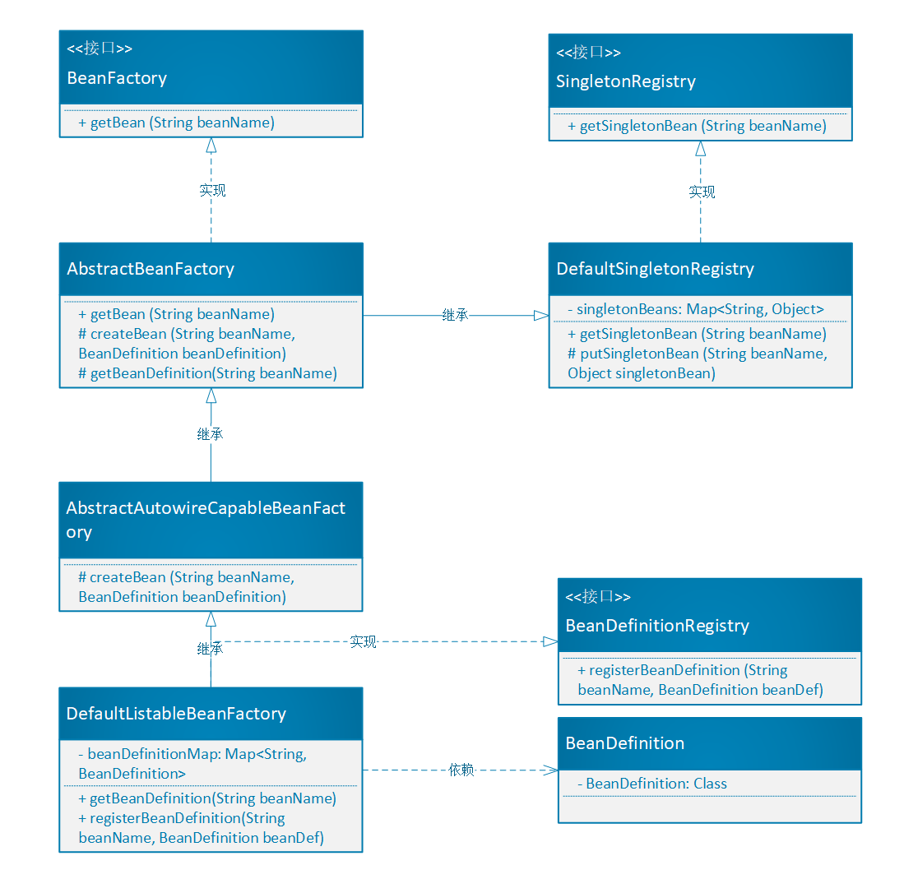

# Step 02：Bean的定义、注册、获取

## 一、背景

实现Bean容器后发现，未能管理BeanDefinition实例化的方式。因此，我们需要把Bean的定义、创建、注册进行抽象，以便组合使用。

BeanDefinition存在多种实例化方式，例如单例、每次新建等等。如何优化硬编码和大量 if..else......，设计模式是可参考的方法论。而设计模式在JAVA（面向对象语言）中落地，无非是利用 **接口**、**类实现接口**、**抽象类实现接口**、**继承抽象类**、**继承类**。从而隔离类的基础功能（A类）、通用功能（A~D类）、业务功能（B/C/D类）。

## 二、设计

* BeanFactory接口：定义获取Bean的方法。
* AbstractBeanFactory：实现获取Bean的功能。作为模板模式的核心类。
  * 模板模式：将核心方法的调用逻辑和标准实现统一。
* SingletonRegistry：定义获取单例Bean的方法。
* DefaultSingletonRegistry：实现获取单例Bean，注册单例Bean，存储单例Bean的功能。AbstractBeanFactory继承该类，获得管理单例Bean的功能。
  * 继承虽然强大，可获取父类功能，但存在单继承限制。
* AbstractAutowireCapableBeanFactory：继承AbstractBeanFactory，每层实现类只实现关心的方法。从而对不同业务功能隔离和分层。该层实现BeanDefinition实例化，并插入单例Bean的功能。
* DefaultListableBeanFactory：继承AbstractAutowireCapableBeanFactory，拥有获取Bean的功能。
  * 需实现获取BeanDefinition，注册BeanDefinition，存储BD的功能。
  * 因此需实现BeanDefinitionRegistry接口
* BeanDefinitionRegistry接口：定义注册BeanDefinition的方法。



## 三、实现

工程结构

```text
small-spring-step-02
└── src
    ├── main
    │   └── java
    │       └── cn.fanyy51.smallspring
    │           ├── factory
    │           │   ├── BeanFactory.java
    │           │   ├── AbstractBeanFactory.java
    │           │   ├── AbstractAutowireCapableBeanFactory.java
    │           │   ├── DefaultListableBeanFactory.java
    │           ├── registry
    │           │   ├── BeanDefinitionRegistry.java
    │           │   ├── SingletonBeanRegistry.java
    │           │   └── DefaultSingletonBeanRegistry.java
    │           └── BeanDefinition.java
    └── test
        └── java
            └── cn.fanyy51.smallspring
                ├── bean
                │   └── UserService.java
                └── ControllerTest.java       
```

实现类


