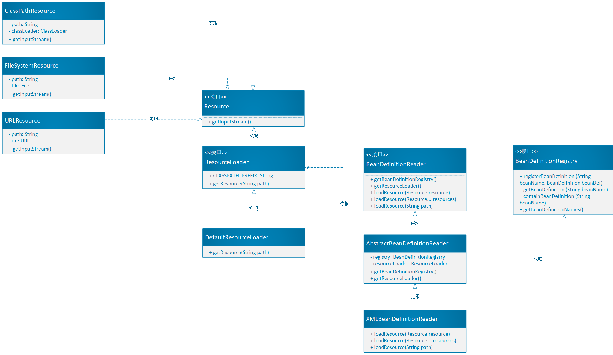
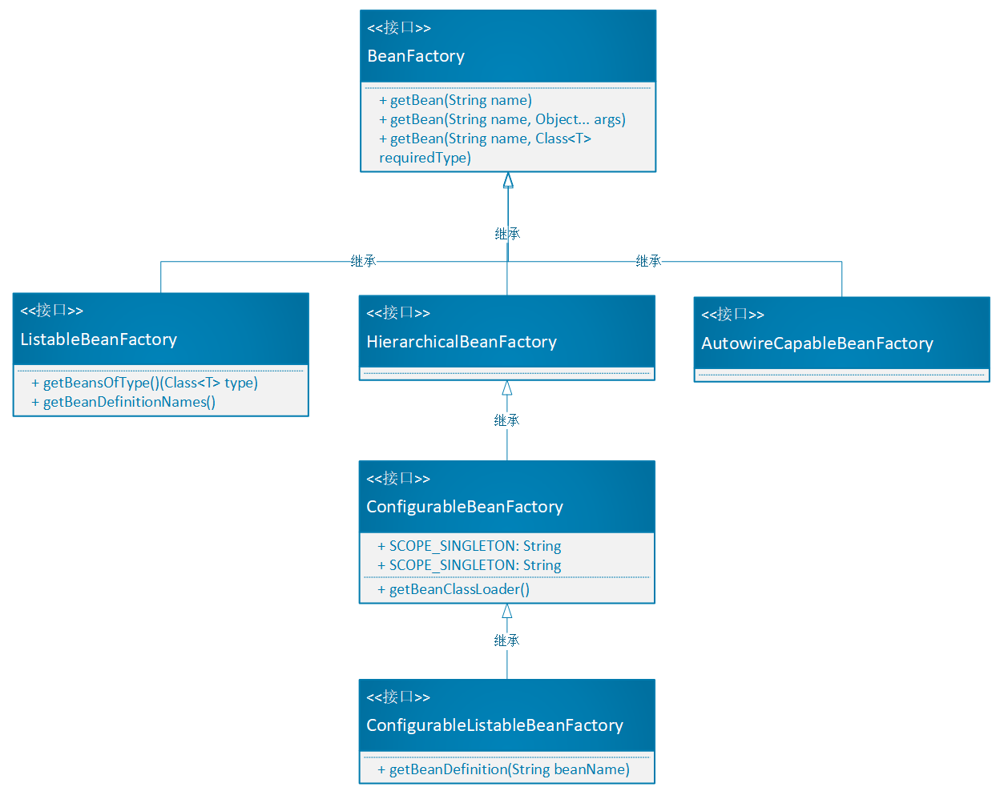

# Step 05：读取配置

## 一、背景

（补充上一节测试类截图）

```java
@Test
    public void beanReferenceTest() {
        // 1、初始化 BeanFactory
        DefaultListableBeanFactory beanFactory = new DefaultListableBeanFactory();

        // 2、dao注册
        PropertyValues innerPVs = new PropertyValues();
        innerPVs.getPvs().add(new PropertyValue("inStr", "identify String"));
        BeanDefinition innerBeanDef = new BeanDefinition(InnerImpl.class, innerPVs);
        // 3、service注册，设置属性dao
        PropertyValues userPVs = new PropertyValues();
        userPVs.getPvs().add(new PropertyValue("innerImpl", new BeanReference(InnerImplBeanName)));
        BeanDefinition userBeanDef = new BeanDefinition(UserService.class, userPVs);

        beanFactory.putBeanDefinition(InnerImplBeanName, innerBeanDef);
        beanFactory.putBeanDefinition(UserServiceBeanName, userBeanDef);

        // 4、service获取bean
        UserService userService = (UserService) beanFactory.getBean(UserServiceBeanName);
        userService.queryUserInfo();
        userService.getInnerImpl().queryStr();

    }
```

将 BeanDefinition放入 xml配置文件中，通过读取并解析xml生成 BeanDefinition。通过读取配置完成步骤2、3的动作。


## 二、设计



【读取配置部分】

1、通过不同的资源策略（Resource）获得输入流，Resource接口定义获得输入流（资源）的功能。不同实现类完成多种实现逻辑。

一个资源固定为一个Resource对象，因此Resource实现类的属性标记为final，防止创建后更改。getPath等方法标记为final，表示无法被重写。

**接口管定义，抽象类处理非接口功能外的功能/组件填充，实现类可只关心具体的业务实现。**

2、统一用户使用资源（Resource）的姿势，通过资源加载器（ResourceLoader接口）定义获取资源的功能。即ResourceLoader依赖Resource。

3、**统一**使用ResourceLoader读取配置，使用BeanDefinitionRegistry注册Bean定义的**行为**。通过BeanDefinitionReader接口（Bean定义读取接口），定义加载BeanDefinition功能。即BeanDefinitionReader依赖ResourceLoader和BeanDefinitionRegistry。



【Bean工厂部分】

回顾之前的设计：

* BeanFactory：定义获取Bean行为；
* AbstractBeanFactory：具有BeanRegistry的能力，实现了getBean功能；
* AbstractAutowireCapableBeanFactory：实现了BeanInstantiation，实例化Bean的功能；
* DefaultListableBeanFactory：实现了BeanDefinition注册、管理的功能；

根据本需求（读取配置注册BeanDefinition），以及后续需求，增加框架扩展性，进行下列拆解设计（参考spring源码）：

* BeanFactory：定义获取Bean行为，增加 getBean(beanName, Class\<T> requiredType)按类型获取（通过泛型解决代码强转问题）；
* ListableBeanFactory：继承BeanFactory的接口，增加管理Bean的功能（getBeansOfType，getBeanDefinitonNames）；
* HierarchicalBeanFactory：分层BeanFactory，增加获取父类BeanFactory从而扩展工厂的层次子接口；
* AutowireCapableBeanFactory：增加自动化处理工厂配置的功能；
* ConfigurableBeanFactory：增加获取BeanPostProcessor，BeanClassLoader等的配置化接口；
* ConfigurableListableBeanFactory：增加分析、修改Bean，预先实例化功能的接口；

## 三、实现

### Resource

```java
public interface Resource {

    public abstract InputStream getInputStream() throws Exception;

}
```

### ClassPathResource

```java
public class ClassPathResource implements Resource {

    private final String path;

    private final ClassLoader classLoader;

    @Override
    public InputStream getInputStream() throws Exception {
        InputStream inputStream = classLoader.getResourceAsStream(path);
        if (inputStream == null) {
            throw new FileNotFoundException(this.path + "cannot be opened because file not found");
        }
        return inputStream;
    }
}
```

### FileSystemResource

```java
public class FileSystemResource implements Resource{

    private final String path;

    private final File file;

    @Override
    public InputStream getInputStream() throws Exception {
        InputStream inputStream = new FileInputStream(file);
        if (inputStream == null) {
            throw new FileNotFoundException(this.path + "cannot be opened because file not found");
        }
        return inputStream;
    }
}
```

### UrlResource

```java
public class UrlResource implements Resource {

    private final String path;

    private final URL url;

    @Override
    public InputStream getInputStream() throws Exception {
        URLConnection connection = this.url.openConnection();

        try {
            return connection.getInputStream();
        }catch (IOException e) {
            if (connection instanceof HttpURLConnection) {
                 ((HttpURLConnection) connection).disconnect();
            }
            throw e;
        }

    }
}
```

### ResourceLoader

```java
public interface ResourceLoader {

    static final String CLASSPATH_PREFIX = "classpath:";

    public abstract Resource getResource(String path);
}
```

### DefaultResourceLoader

```java
public class DefaultResourceLoader implements ResourceLoader{

    @Override
    public Resource getResource(String path) {
        Assert.notNull(path, "Path must be not null");
        if (path.startsWith(CLASSPATH_PREFIX)) {
            // 通过 classpath:前缀，标识使用ClassPathResource，从类路径中加载资源
            return new ClassPathResource(path.substring(CLASSPATH_PREFIX.length()));
        }
        try {
            return new UrlResource(path);
        }catch (MalformedURLException e) {
            return new FileSystemResource(path);
        }

    }
}
```

### BeanDefinitionReader

```java
public interface BeanDefinitionReader {

    BeanDefinitionRegistry getBeanDefinitionRegistry();

    ResourceLoader getResourceLoader();

    void loadResource(Resource resource);

    void loadResource(Resource... resources);

    void loadResource(String path);

}
```

### AbstractBeanDefinitionReader

```java
public abstract class AbstractBeanDefinitionReader implements BeanDefinitionReader{

    private final BeanDefinitionRegistry beanDefinitionRegistry;

    private final ResourceLoader resourceLoader;

    public AbstractBeanDefinitionReader(BeanDefinitionRegistry beanDefinitionRegistry) {
        this.beanDefinitionRegistry = beanDefinitionRegistry;
        this.resourceLoader = new DefaultResourceLoader();
    }

    public AbstractBeanDefinitionReader(BeanDefinitionRegistry beanDefinitionRegistry, ResourceLoader resourceLoader) {
        this.beanDefinitionRegistry = beanDefinitionRegistry;
        this.resourceLoader = resourceLoader;
    }

    @Override
    public BeanDefinitionRegistry getBeanDefinitionRegistry() {
        return beanDefinitionRegistry;
    }

    @Override
    public ResourceLoader getResourceLoader() {
        return resourceLoader;
    }

}
```

### XMLBeanDefinitionReader

```java
public class XMLBeanDefinitionReader extends AbstractBeanDefinitionReader {

    public XMLBeanDefinitionReader(BeanDefinitionRegistry beanDefinitionRegistry) {
        super(beanDefinitionRegistry);
    }

    public XMLBeanDefinitionReader(BeanDefinitionRegistry beanDefinitionRegistry, ResourceLoader resourceLoader) {
        super(beanDefinitionRegistry, resourceLoader);
    }


    @Override
    public void loadResource(Resource... resources) {
        for (Resource resource:resources) {
            loadResource(resource);
        }
    }

    @Override
    public void loadResource(String path) {
        ResourceLoader resourceLoader = getResourceLoader();
        Resource resource = resourceLoader.getResource(path);
        loadResource(resource);
    }

    /**
     * @description 统一加载资源入口
     * @param resource
     */
    @Override
    public void loadResource(Resource resource) {
        try (InputStream is = resource.getInputStream();){
            doLoadResource(is);
        }catch (Exception e) {
            e.printStackTrace();
        }
    }

    private void doLoadResource(InputStream is) throws ClassNotFoundException, RuntimeException {
        Document document = XmlUtil.readXML(is);
        Element root = document.getDocumentElement();
        NodeList nodes = root.getChildNodes();
        for (int i=0;i<nodes.getLength();i++) {
            // 类型为Element
            if (!(nodes.item(i) instanceof Element)) {
                continue;
            }
            // 标签名为bean
            if (!"bean".equals(nodes.item(i).getNodeName())) {
                continue;
            }

            // 解析标签
            Element element = (Element) nodes.item(i);
            String id = element.getAttribute("id");
            String classPath = element.getAttribute("class");
            // 定义Bean
            Class clazz = Class.forName(classPath);
            BeanDefinition beanDefinition = new BeanDefinition(clazz);

            // 读取下级标签（属性值）
            NodeList eNodes = element.getChildNodes();
            for (int j=0;j<eNodes.getLength();j++) {
                // 类型为Element
                if (!(eNodes.item(j) instanceof Element)) {
                    continue;
                }
                // 标签名为property
                if (!"property".equals(eNodes.item(j).getNodeName())) {
                    continue;
                }
                // 解析标签
                Element eElement = (Element) eNodes.item(j);
                String name = eElement.getAttribute("name");
                String value = eElement.getAttribute("value");
                String ref = eElement.getAttribute("ref");
                // 定义属性
                Object propertyValue = StrUtil.isNotEmpty(ref)?new BeanReference(ref):value;
                if (beanDefinition.getProperties() != null) {
                    beanDefinition.getProperties().getProperties().add(new Property(name, propertyValue));
                } else {
                    beanDefinition.setProperties(new Properties());
                    beanDefinition.getProperties().getProperties().add(new Property(name, propertyValue));
                }
            }

            // 注册BeanDefinition
            if (getBeanDefinitionRegistry().containBeanDefinition(id)) {
                throw new RuntimeException("Duplicate beanName[" + id + "] is not allowed");
            }
            getBeanDefinitionRegistry().registryBeanDefinition(id, beanDefinition);

        }


    }

}
```

### TestDefaultResourceLoader

```java
@Before
    public void init() {
        resourceLoader = new DefaultResourceLoader();
    }

    @Test
    public void test_classpath() throws Exception {
        Resource resource = resourceLoader.getResource("classpath:flow1/config.cfg");
        InputStream is = resource.getInputStream();
//        IoUtil.readUtf8(is);
        readUTF8(is);
    }

    @Test
    public void test_file() throws Exception {
        Resource resource = resourceLoader.getResource("D://test.txt");
        InputStream is = resource.getInputStream();
        readUTF8(is);
    }

//    private static String URL = "https://github.com/fuzhengwei/small-spring/blob/main/small-spring-step-05/src/main/java/cn/bugstack/springframework/util/ClassUtils.java";
    private static String URL = "http://git.dova.me/shixiang/api.sx.shixiangcap.com/blob/master/%E6%9B%BF%E6%8D%A2.txt";

    @Test
    public void test_url() throws Exception {
        Resource resource = resourceLoader.getResource(URL);
        InputStream is = resource.getInputStream();
        readUTF8(is);
    }

    private static void readUTF8(InputStream is) throws IOException {
        int bytelen = is.available();
        byte[] result = new byte[bytelen];
        int resultint =  is.read(result);
        if (resultint != bytelen) {
            throw new IOException("is.available != is.read");
        }
        String str = new String(result, Charset.forName("UTF-8"));
        System.out.println(str);
    }
```


```java
@Test
    public void test_classpath_xml() {

        DefaultListableBeanFactory beanFactory = new DefaultListableBeanFactory();

        XMLBeanDefinitionReader xmlReader = new XMLBeanDefinitionReader(beanFactory);
        // 等于
//        XMLBeanDefinitionReader xmlReader = new XMLBeanDefinitionReader(beanFactory, new DefaultResourceLoader());

        xmlReader.loadResource("classpath:spring.xml");

        UserService userService = beanFactory.getBean("userService", UserService.class);
        userService.queryUserInfo();

    }
```


```java
public
```


```java
public
```


```java
public
```


```java
public
```

